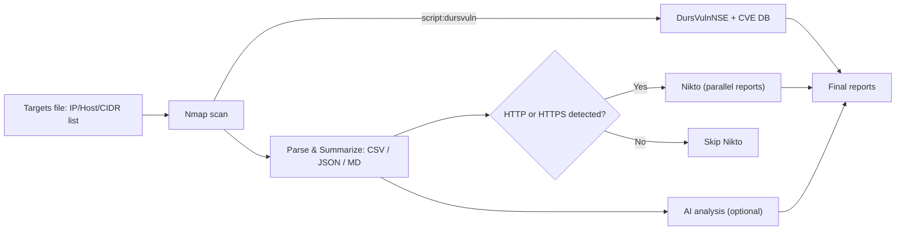
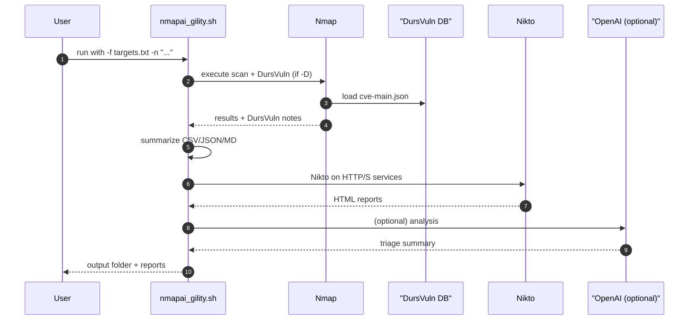
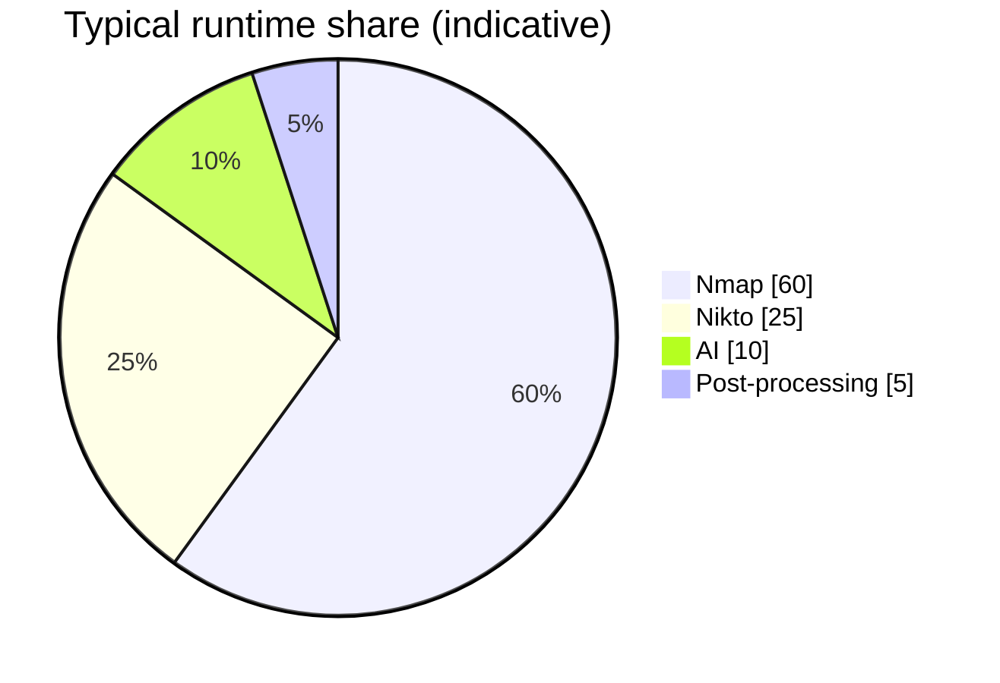

# NmapAIgility

**NmapAIgility** is a powerful and flexible security scanning toolchain that integrates **Nmap**, **DursVulnNSE**, **Nikto**, and optional **AI-assisted analysis** to map attack surfaces and highlight likely risks—fast.

> ⚠️ **Legal/Ethical**: Only scan systems you own or are explicitly authorized to test.


---

## Table of Contents
- [Features](#features)
- [How It Works (Diagrams)](#how-it-works-diagrams)
- [Prerequisites](#prerequisites)
- [Installation](#installation)
- [Quick Start](#quick-start)
- [Usage](#usage)
  - [Common Examples](#common-examples)
  - [CLI Options](#cli-options)
  - [Environment Variables](#environment-variables)
- [Outputs](#outputs)
- [Troubleshooting](#troubleshooting)
- [Roadmap](#roadmap)
- [Contributing](#contributing)
- [License](#license)
- [Acknowledgments](#acknowledgments)

---

## Features

- **High-fidelity discovery (Nmap):** Normal / grepable / XML outputs for reliable post-processing.
- **Local CVE enrichment (DursVulnNSE):** Use a curated `cve-main.json` database for fast, offline vuln matches.
- **Targeted web checks (Nikto):** Only scans HTTP/HTTPS services detected by Nmap, with parallel execution.
- **AI-assisted triage (optional):** Summarize findings and recommended actions via OpenAI (chunked + retries).
- **Friendly UX:** Dry-run, debug mode, colored logs, timestamped output directory, structured summaries (CSV/JSON/MD).
- **Safety rails:** Dependency checks, robust error handling, graceful fallbacks.

---

## How It Works (Diagrams)

### Pipeline Flow


### High-level Sequence


### (Example) Module Weighting


> The pie chart is illustrative. Actual proportions depend on scope, network conditions, and flags.

---

## Prerequisites

Install these tools (minimal set varies with features you enable):

- **Nmap** (7.94+ recommended)
- **jq** (JSON parsing)
- **awk**, **sed**, **grep**, **xargs**, **tee**
- **curl** (required if using AI or DB auto-fetch)
- **Nikto** (optional, for web checks)
- **Python 3** (optional, if you use DursVulnNSE’s `db_updater.py`)

For **DursVulnNSE**:
- Either install globally (their installer configures `--script dursvuln`), or use a local path to `dursvuln.nse`.
- Database: `cve-main.json` (from a local build or download the prebuilt file from the DursVuln-Database repo).

---

## Installation

```bash
# Clone your repository
git clone https://github.com/Masriyan/NmapAIgility.git
cd NmapAIgility

# Make the script executable
chmod +x scripts/nmapai_gility.sh

# (Debian/Ubuntu) Install basic deps if needed
sudo apt-get update && sudo apt-get install -y nmap jq curl nikto
```

**Optional: DursVulnNSE setup** (two common approaches):

```bash
# (A) Global install (simplest to run with -G)
git clone https://github.com/roomkangali/DursVulnNSE
cd DursVulnNSE
chmod +x configure-dursvuln.sh
sudo ./configure-dursvuln.sh    # installs NSE into your Nmap scripts dir

# (B) Local usage (run with -L and -P)
git clone https://github.com/roomkangali/DursVulnNSE
# database will live in ./DursVulnNSE/database after you run updater
```

---

## Quick Start

```bash
# Fast service discovery + DursVuln (global) + DB auto-fetch
./scripts/nmapai_gility.sh \
  -f targets.txt \
  -n "-sV -T4 --top-ports 2000" \
  -D -G -U -S HIGH -O concise
```

Output directory (e.g., `out_nmapai_YYYYMMDD_HHMMSS`) will contain raw scans, summaries, and (if enabled) Nikto/AI files.

---

## Usage

```bash
./scripts/nmapai_gility.sh -f <ip_list_file> -n "<nmap_parameters>" [options]
```

### Common Examples

```bash
# Basic discovery (no Nikto/AI):
./scripts/nmapai_gility.sh -f targets.txt -n "-sV -T4 --top-ports 1000"

# With DursVuln (global script) & DB refresh:
./scripts/nmapai_gility.sh -f targets.txt -n "-sV -T4 -p 80,443,8080,8443" -D -G -U -S MEDIUM -O full

# With DursVuln (local script/path):
./scripts/nmapai_gility.sh -f targets.txt -n "-sV -Pn -p 21,22,25,80,110,143,443" \
  -D -L ./DursVulnNSE/dursvuln.nse -P ./DursVulnNSE/database/cve-main.json -S HIGH -O concise

# Skip Nikto and enable AI (requires OPENAI_API_KEY in env):
OPENAI_API_KEY=sk-... ./scripts/nmapai_gility.sh \
  -f targets.txt -n "-sC -sV -O -T4 --top-ports 1500" -K -a
```

### CLI Options

| Option | Description |
|-------:|-------------|
| `-f FILE` | Target list (IP / host / CIDR). Comments (#) and blank lines are ignored. |
| `-n "PARAMS"` | Quoted Nmap params (e.g., `"-sV -T4 --top-ports 2000"`). |
| `-o DIR` | Output directory (default: `./out_nmapai_<timestamp>`). |
| `-t NUM` | Nikto parallel threads (default `2`). |
| `-K` | Disable Nikto stage. |
| `-a` | Enable AI analysis (uses OpenAI). |
| `-m MODEL` | AI model (default: env `OPENAI_MODEL` or `gpt-4o-mini`). |
| `-D` | Enable DursVulnNSE integration in Nmap. |
| `-G` | Use globally installed NSE (`--script dursvuln`). |
| `-L PATH` | Path to local `dursvuln.nse` if not using `-G`. |
| `-P PATH` | Path to `cve-main.json` database (DursVuln). |
| `-S LEVEL` | Minimum severity `LOW|MEDIUM|HIGH|CRITICAL`. |
| `-O MODE` | DursVuln output mode `concise|full` (default `concise`). |
| `-U` | Update/fetch `cve-main.json` (from local updater or DB repo). |
| `-d` | Debug mode (`set -x`). |
| `-r` | Dry-run (print commands only; don’t execute). |
| `-h` | Help. |

### Environment Variables

| Variable | Purpose | Default |
|---------:|---------|---------|
| `OPENAI_API_KEY` | API key for AI analysis (`-a`). | *(required if `-a`)* |
| `OPENAI_MODEL` | Model name for AI analysis. | `gpt-4o-mini` |
| `OPENAI_ENDPOINT` | Completions endpoint URL. | `https://api.openai.com/v1/chat/completions` |

> No keys are hard-coded. If `-a` is not used, OpenAI is never contacted.

---

## Outputs

Inside your timestamped output folder:

```
out_nmapai_2025xxxx_xxxxxx/
├── nmap_results.nmap       # Human-readable Nmap output (with DursVuln lines if enabled)
├── nmap_results.gnmap      # Grepable for post-processing
├── nmap_results.xml        # Machine-readable XML
├── nmap_summary.csv        # host,port,proto,service
├── nmap_summary.json       # structured JSON of the CSV
├── nmap_summary.md         # per-host Markdown tables
├── dursvuln_summary.md     # extracted DursVuln findings (if -D)
├── nikto/                  # HTML reports (if Nikto enabled)
├── ai_analysis.md          # AI triage notes (if -a)
└── nmap_scan.log           # Full process log
```

---

## Troubleshooting

- **“Missing dependency”**: Install the named package (`nmap`, `jq`, `curl`, `nikto`, etc.).
- **DursVuln not found**: Use `-G` for global or `-L /path/to/dursvuln.nse` for local.
- **No `cve-main.json`**: Point to it with `-P` or run with `-U` to fetch.
- **Nmap version warning**: DursVuln works best with Nmap ≥ 7.94; upgrade if possible.
- **AI errors / HTTP 429/5xx**: The script retries with exponential backoff; check your quotas and logs.
- **Nikto skipped**: The tool only runs Nikto when Nmap finds HTTP/S ports or http-ish services.

---

## Roadmap

- [ ] Merge DursVuln CVE entries directly into `nmap_summary.md` tables with severity badges.
- [ ] Single interactive HTML report (embed summaries + link Nikto reports).
- [ ] Optional UDP profiles and service heuristics for web service detection.
- [ ] Pluggable exporters (SARIF, Elastic Common Schema).

---

## Contributing

PRs are welcome!

```bash
# 1) Fork and clone
git checkout -b feature/YourFeature
# 2) Commit
git commit -m "feat: add awesome thing"
# 3) Push
git push origin feature/YourFeature
# 4) Open a pull request
```

Please keep changes well-scoped and include samples or tests if you touch parsing logic.

---

## License

This project is licensed under the **MIT License** — see [LICENSE](LICENSE).

---

## Acknowledgments

- [Nmap](https://nmap.org/) — the bedrock of network discovery.
- [DursVulnNSE](https://github.com/roomkangali/DursVulnNSE) and [DursVuln-Database](https://github.com/roomkangali/DursVuln-Database).
- [Nikto](https://cirt.net/Nikto2) — classic web server checker.
- [OpenAI](https://openai.com/) — optional AI analysis engine.

---

> Questions or ideas? Open an issue or start a discussion in the repo.
