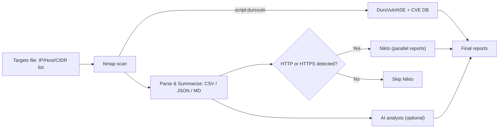
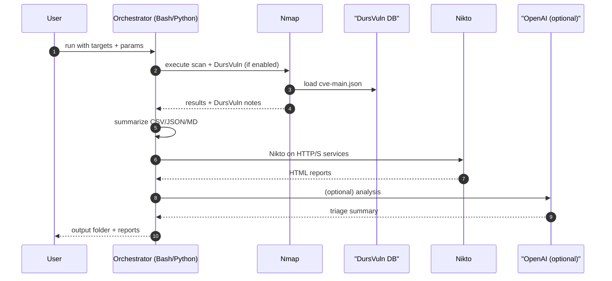
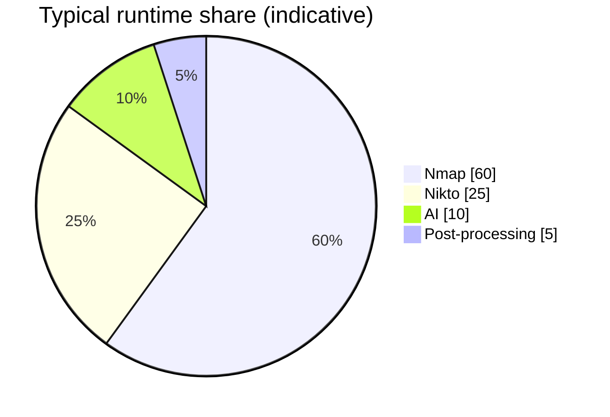

# NmapAIgility

**NmapAIgility** is a powerful and flexible security scanning toolchain that integrates **Nmap**, **DursVulnNSE**, **Nikto**, and optional **AI-assisted analysis** to map attack surfaces and highlight likely risks—fast.

> ⚠️ **Legal/Ethical**: Only scan systems you own or are explicitly authorized to test.


---

## Table of Contents
- [What’s New (2025-08)](#whats-new-2025-08)
- [Features](#features)
- [Editions](#editions)
- [How It Works (Diagrams)](#how-it-works-diagrams)
- [Prerequisites](#prerequisites)
- [Installation](#installation)
  - [Bash Edition](#bash-edition)
  - [Python Edition](#python-edition)
- [Quick Start](#quick-start)
- [Usage](#usage)
  - [Bash CLI Options](#bash-cli-options)
  - [Python CLI Options](#python-cli-options)
  - [Environment Variables](#environment-variables)
- [Scenarios & Full Examples](#scenarios--full-examples)
- [Outputs](#outputs)
- [Troubleshooting](#troubleshooting)
- [Roadmap](#roadmap)
- [Contributing](#contributing)
- [License](#license)
- [Acknowledgments](#acknowledgments)

---

## What’s New (2025-08)

- **Python rewrite (`nmapai_gility.py`)** with a modern UX using **Rich** for animated progress bars:
  - Live Nmap % via `--stats-every` parsing
  - Per-target Nikto progress
  - Per-chunk AI analysis progress
- **Bash edition** hardened:
  - Correct tokenization of `-n "<params>"` (fixes `scantype not supported`)
  - Quote-safe Nikto runner and better logging
- **DursVuln integration** maintained:
  - Global or local NSE with DB refresh (`cve-main.json`) option
- **Summaries**: CSV/JSON/Markdown outputs for quick triage

---

## Features

- **High-fidelity discovery (Nmap):** Normal / grepable / XML outputs for reliable post-processing.
- **Local CVE enrichment (DursVulnNSE):** Use a curated `cve-main.json` database for fast, offline vuln matches.
- **Targeted web checks (Nikto):** Only scans HTTP/HTTPS services detected by Nmap, with parallel execution.
- **AI-assisted triage (optional):** Summarize findings and recommended actions via OpenAI (chunked).
- **Friendly UX:** Dry-run, debug mode, colored logs, timestamped output directory, structured summaries (CSV/JSON/MD).
- **Safety rails:** Dependency checks, robust error handling, graceful fallbacks.
- **Cross-platform:** Bash (Linux/macOS) + Python (Linux/macOS/Windows).

---

## Editions

- **Bash**: `scripts/nmapai_gility.sh` — portable shell pipeline with summaries and optional AI.
- **Python**: `scripts/nmapai_gility.py` — rich TUI with animated progress bars and the same features.

You can keep both and choose per environment.

---

## How It Works (Diagrams)

### Pipeline Flow


### High-level Sequence


### (Example) Module Weighting


> The pie chart is illustrative. Actual proportions depend on scope, network conditions, and flags.

---

## Prerequisites

### Common
- **Nmap** (7.94+ recommended)
- **Nikto** (optional, for web checks)
- **DursVulnNSE** (optional): NSE + `cve-main.json` DB
- **Targets file** (one host/IP/CIDR per line; `#` comments allowed)

### Bash-only deps
- `jq`, `awk`, `sed`, `grep`, `xargs`, `tee`, `curl` (for AI/DB download)

### Python-only deps
- Python **3.9+**
- `rich` and `requests`:
  ```bash
  python -m pip install rich requests
  ```

---

## Installation

```bash
# Clone the repository
git clone https://github.com/Masriyan/NmapAI-gility.git
cd NmapAI-gility

# Bash edition
chmod +x scripts/nmapai_gility.sh

# Python edition (install deps)
python -m pip install -U rich requests
```

### Bash Edition
```bash
# (Debian/Ubuntu) Install base tools
sudo apt-get update && sudo apt-get install -y nmap jq curl nikto
```

### Python Edition
- Works on Linux/macOS/Windows.
- Ensure **Nmap** (and **Nikto** if needed) are in your PATH.

**Optional: DursVulnNSE setup**

```bash
# (A) Global install (simplest; use -G / --dursvuln-global)
git clone https://github.com/roomkangali/DursVulnNSE
cd DursVulnNSE
chmod +x configure-dursvuln.sh
sudo ./configure-dursvuln.sh    # installs NSE into Nmap's scripts dir

# (B) Local usage (use -L/--dursvuln-script and -P/--dursvuln-db)
git clone https://github.com/roomkangali/DursVulnNSE
# Optional: fetch DB or run their updater to generate ./database/cve-main.json
```

---

## Quick Start

```bash
# Prepare a simple target list
echo "scanme.nmap.org" > targets.txt

# Bash — fast discovery + DursVuln global + DB auto-fetch
./scripts/nmapai_gility.sh -f targets.txt -n "-sV -T4 --top-ports 2000" -D -G -U -S HIGH -O concise

# Python — same idea with animated progress
python scripts/nmapai_gility.py -f targets.txt -n "-sV -T4 --top-ports 2000" -D -G -U -S HIGH -O concise
```

---

## Usage

Both editions accept similar flags; names differ slightly.

### Bash CLI Options

| Option | Description |
|-------:|-------------|
| `-f FILE` | Target list (IP / host / CIDR). Comments `#` and blank lines ignored. |
| `-n "PARAMS"` | Quoted Nmap params (e.g., `"-sV -T4 --top-ports 2000"`). Unicode dashes normalized. |
| `-o DIR` | Output directory (default: `./out_nmapai_<timestamp>`). |
| `-t NUM` | Nikto parallel threads (default `2`). |
| `-K` | Disable Nikto stage. |
| `-a` | Enable AI analysis (uses OpenAI). |
| `-m MODEL` | AI model (default: env `OPENAI_MODEL` or `gpt-4o-mini`). |
| `-D` | Enable DursVulnNSE integration in Nmap. |
| `-G` | Use globally installed NSE (`--script dursvuln`). |
| `-L PATH` | Path to local `dursvuln.nse` if not using `-G`. |
| `-P PATH` | Path to `cve-main.json` database (DursVuln). |
| `-S LEVEL` | Minimum severity `LOW|MEDIUM|HIGH|CRITICAL`. |
| `-O MODE` | DursVuln output mode `concise|full` (default `concise`). |
| `-U` | Update/fetch `cve-main.json` (from local updater or DB repo). |
| `-d` | Debug mode (`set -x`). |
| `-r` | Dry-run (print commands only; don’t execute). |
| `-h` | Help. |

### Python CLI Options

| Option | Description |
|-------:|-------------|
| `-f / --file FILE` | Target list (IP/host/CIDR). |
| `-n / --nmap "PARAMS"` | Quoted Nmap params (e.g., `"-sV -T4 --top-ports 2000"`). |
| `-o / --out-dir DIR` | Output directory (default: `./out_nmapai_<timestamp>`). |
| `-t / --threads NUM` | Nikto parallel threads (default `2`). |
| `-K / --no-nikto` | Disable Nikto stage. |
| `-a / --ai` | Enable AI analysis (requires `OPENAI_API_KEY`). |
| `-m / --model` | AI model (default: env `OPENAI_MODEL` or `gpt-4o-mini`). |
| `--ai-endpoint URL` | Chat Completions endpoint URL. |
| `--ai-max-tokens N` | Max tokens per chunk (default `700`). |
| `--ai-temp F` | Temperature (default `0.2`). |
| `--ai-top-p F` | Top-p (default `1.0`). |
| `-D / --dursvuln` | Enable DursVuln NSE. |
| `-G / --dursvuln-global` | Use globally installed `--script=dursvuln`. |
| `-L / --dursvuln-script PATH` | Local `dursvuln.nse`. |
| `-P / --dursvuln-db PATH` | Path to `cve-main.json`. |
| `-S / --dursvuln-min LVL` | `LOW|MEDIUM|HIGH|CRITICAL`. |
| `-O / --dursvuln-output MODE` | `concise|full` (default `concise`). |
| `-U / --dursvuln-update` | Download/refresh `cve-main.json` if needed. |
| `-r / --dry-run` | Dry run. |
| `-d / --debug` | Debug mode (verbose logs). |

### Environment Variables

| Variable | Purpose | Default |
|---------:|---------|---------|
| `OPENAI_API_KEY` | API key for AI analysis (`-a/--ai`). | *(required if AI used)* |
| `OPENAI_MODEL` | Model name for AI analysis. | `gpt-4o-mini` |
| `OPENAI_ENDPOINT` | Completions endpoint URL. | `https://api.openai.com/v1/chat/completions` |

> No keys are hard-coded. If AI is not enabled, OpenAI is never contacted.

---

## Scenarios & Full Examples

> Assume you created `targets.txt` with one host per line.

### 1) **Nmap only** (no Nikto/AI)
**Bash**
```bash
./scripts/nmapai_gility.sh -f targets.txt -n "-sV -T4 --top-ports 200"
```
**Python**
```bash
python scripts/nmapai_gility.py -f targets.txt -n "-sV -T4 --top-ports 200"
```

### 2) **DursVuln (global NSE) + DB refresh**
**Bash**
```bash
./scripts/nmapai_gility.sh -f targets.txt -n "-sV -T4 --top-ports 1000" -D -G -U -S HIGH -O concise
```
**Python**
```bash
python scripts/nmapai_gility.py -f targets.txt -n "-sV -T4 --top-ports 1000" -D -G -U -S HIGH -O concise
```

### 3) **DursVuln (local NSE)** with local DB
**Bash**
```bash
./scripts/nmapai_gility.sh -f targets.txt -n "-sV -Pn -p 21,22,25,80,110,143,443" \
  -D -L ./DursVulnNSE/dursvuln.nse -P ./DursVulnNSE/database/cve-main.json -S MEDIUM -O full
```
**Python**
```bash
python scripts/nmapai_gility.py -f targets.txt -n "-sV -Pn -p 21,22,25,80,110,143,443" \
  -D -L ./DursVulnNSE/dursvuln.nse -P ./DursVulnNSE/database/cve-main.json -S MEDIUM -O full
```

### 4) **Nikto demo** (local web server)
Start a simple server in another terminal:
```bash
python -m http.server 8000
```
Then run the scan:
**Bash**
```bash
echo "127.0.0.1" > targets.txt
./scripts/nmapai_gility.sh -f targets.txt -n "-sV -Pn -p 8000 --open" -t 4
```
**Python**
```bash
echo "127.0.0.1" > targets.txt
python scripts/nmapai_gility.py -f targets.txt -n "-sV -Pn -p 8000 --open" -t 4
```

### 5) **AI triage** (requires `OPENAI_API_KEY`)
**Bash**
```bash
export OPENAI_API_KEY="sk-..."
./scripts/nmapai_gility.sh -f targets.txt -n "-sC -sV -O -T4 --top-ports 1500" -K -a
```
**Python**
```bash
export OPENAI_API_KEY="sk-..."
python scripts/nmapai_gility.py -f targets.txt -n "-sC -sV -O -T4 --top-ports 1500" -K -a
```

### 6) **Dry-run** (validate flags; no scanning)
**Bash**
```bash
./scripts/nmapai_gility.sh -f targets.txt -n "-sV -T4 --top-ports 200" -r -d
```
**Python**
```bash
python scripts/nmapai_gility.py -f targets.txt -n "-sV -T4 --top-ports 200" -r -d
```

### 7) **Windows (PowerShell) examples**
```powershell
# Python edition
python .\scripts\nmapai_gility.py -f .\targets.txt -n "-sV -T4 --top-ports 200"

# Set environment variable (session)
$env:OPENAI_API_KEY = "sk-..."
python .\scripts\nmapai_gility.py -f .\targets.txt -n "-sV -T4 --top-ports 200" -a
```

> Tip: On Windows, ensure `nmap.exe` (and `nikto.pl` if used) are available in PATH.

---

## Outputs

Inside your timestamped output folder:
```
out_nmapai_YYYYMMDD_HHMMSS/
├── nmap_results.nmap       # Human-readable Nmap output (with DursVuln lines if enabled)
├── nmap_results.gnmap      # Grepable for post-processing
├── nmap_results.xml        # Machine-readable XML
├── nmap_summary.csv        # host,port,proto,service
├── nmap_summary.json       # structured JSON of the CSV
├── nmap_summary.md         # per-host Markdown tables
├── dursvuln_summary.md     # extracted DursVuln findings (if enabled)
├── nikto/                  # HTML reports (if Nikto enabled)
├── ai_analysis.md          # AI triage notes (if AI enabled)
└── nmap_scan.log           # Full process log
```

---

## Troubleshooting

- **“Missing dependency”**: Install the named package (`nmap`, `jq`, `curl`, `nikto`, etc.).
- **DursVuln not found**: Use `-G/--dursvuln-global` or `-L/--dursvuln-script` with the correct path.
- **No `cve-main.json`**: Point to it with `-P/--dursvuln-db` or run with `-U/--dursvuln-update` to fetch.
- **Nmap version warning**: DursVuln works best with Nmap ≥ 7.94; upgrade if possible.
- **AI errors / HTTP 429/5xx**: Check your API key, quotas, or retry later. Review `nmap_scan.log`.
- **Nikto skipped**: Tool only runs Nikto when Nmap finds HTTP/S ports or http-ish services.
- **Unicode dashes**: Both editions normalize `–` / `—` to `--` in Nmap params.

---

## Roadmap

- [ ] Merge DursVuln CVE entries directly into `nmap_summary.md` with severity badges.
- [ ] Single interactive HTML report (embed summaries + link Nikto reports).
- [ ] Optional UDP profiles and service heuristics for web detection.
- [ ] Pluggable exporters (SARIF, ECS, JSONL).

---

## Contributing

PRs are welcome!

```bash
# 1) Create a topic branch
git checkout -b feature/YourFeature

# 2) Commit
git commit -m "feat: add awesome thing"

# 3) Push
git push origin feature/YourFeature

# 4) Open a Pull Request
```

Please keep changes well-scoped and include samples or tests if you touch parsing logic.

---

## License

This project is licensed under the **MIT License** — see [LICENSE](LICENSE).

---

## Acknowledgments

- [Nmap](https://nmap.org/) — the bedrock of network discovery.
- [DursVulnNSE](https://github.com/roomkangali/DursVulnNSE) and [DursVuln-Database](https://github.com/roomkangali/DursVuln-Database).
- [Nikto](https://cirt.net/Nikto2) — classic web server checker.
- [OpenAI](https://openai.com/) — optional AI analysis engine.

---

> Questions or ideas? Open an issue or start a discussion in the repo.
